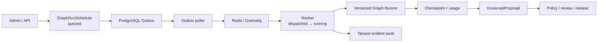

# Agent 注册表、图模板与持久化调度

## 目的

Atlas 将大量 Agent 视为可治理的产品构件，而不是散落在 Worker 中的函数。每个 Agent、
执行图和调度任务都有不可变版本；Redis 只负责传递，PostgreSQL 始终是事实来源。Agent
不能直接修改已发布百科条目，只能生成包含证据的 `GovernedProposal`。

## 声明式 Agent Pack

`agent-packs/<pack>/manifest.json` 列出 Agent 定义和图模板。Agent 定义包含：

- 稳定 ID 与不可变版本；
- 角色、能力和 Handler 适配键；
- 输入与输出契约；
- 可创建的提案类型与最高风险级别；
- `deterministic`、`optional-model` 或 `model-required` 模型政策。

图节点通过 `agentId + agentVersion` 钉住定义版本。修改既有定义或图必须提升版本；
API 启动时将这些 JSON 以 Schema 文档存入数据库，历史调度因此可以在 Agent Pack
升级后按原版本回放。

## 调度与执行



调度记录保存图版本、触发类型、输入、请求主体、幂等键和预算快照。创建调度与 Outbox
事件在同一数据库事务中完成。Poller 只在消息成功写入 Broker 后确认 Outbox；发送后
崩溃可能导致重复投递，但相同调度 ID、幂等键和检查点会阻止重复副作用。

Worker 执行前依次进入 `dispatched` 和 `running`，完成后写入 `completed` 与 Run ID；
异常写入 `failed` 和错误摘要，Dramatiq 可从原检查点重试。状态机禁止完成或取消任务
回到运行态。

`GET /api/v1/jobs/{job_id}/events` 同时识别来源采集任务、Agent 图调度和 Agent 图运行。
默认返回一次数据库中的真实当前状态；`follow=true` 时持续发送状态变化直到终态。事件
包含任务类型、进度、运行或快照标识、提案标识与错误摘要，不由 API 伪造固定的百分比。

## 运行时治理

- Agent Pack 注册时校验 Draft 2020-12 JSON Schema；Runner 在执行前逐节点验证输入，
  在 Handler 返回后验证输出，错误结构不能进入下游节点或提案。
- 节点尝试数、总尝试数、模型调用、输入/输出 Token、成本和截止时间均受图预算限制。
- 提案创建前再次核对产出节点允许的提案类型及风险等级。
- 每个节点的输出、尝试次数、错误和提案 ID 写入持久化检查点。
- 可选模型调用只能经过显式配置的模型代理；成功调用的网关、模型、请求 ID 与用量写入
  节点和 Run 检查点，凭据不会持久化。
- Worker 成功或失败都追加带哈希链的审计事件；浏览器端不持有服务访问令牌。

模型代理、直连禁用和确定性降级语义见
[`model-gateway-and-proxy.md`](model-gateway-and-proxy.md)。

Core Agent Pack `1.4.0` keeps maintenance graph `graph-2.3.0` and adds the
zero-model `quality-maintenance-triage@graph-1.0.0` safety graph. A quality
task, its pinned entity revision, the graph schedule and the next Outbox event
are committed atomically. The triage definition has no proposal permissions;
it can only select an evidence-bearing downstream route.

Graph completion then atomically writes a leaseable Work Item and
`maintenance.work.requested`. The ninth dispatcher topic activates that item
for Agent claims. Broker delivery, lease ownership and queue reads never carry
model credentials or bypass the normal proposal-governance boundary.

The maintenance graph additionally requires the extraction node to receive a
pinned current revision, exact target-path baseline and Citation registration
state. Synchronous trials and Worker schedules use the same domain proposal
builder. This prevents the two execution paths from producing proposals with
different evidence or concurrency semantics. Machine-produced localized
values carry an operation-level `machineGenerated` disclosure that publication
propagates into the entity revision.

### 多实例提案一致性

`GovernedProposal.version` 是数据库分配的单调递增状态版本。创建提案从版本 0 原子写为
版本 1；策略评估、人工审核、冲突合并以及发布状态变化都通过
`WHERE id = ... AND lock_version = expected` 比较并交换。旧 API 实例或并行 Agent
不能用过期内存覆盖新的审核记录；失败返回结构化
`proposal-version-conflict`，包含期望版本和数据库实际版本。

PostgreSQL 是提案事实来源。API 在每个治理读写入口重新装载持久化提案和 Release，
因此 Worker 在 API 启动后创建或推进的提案会立即进入审核队列。Admin 队列与详情页
显示状态版本，提示审核者在并发冲突后基于最新状态重新确认。

### 自动策略分流

创建 `GovernedProposal` 与写入 `governance.proposal.created` Outbox 事件位于同一事务。
Dispatcher 只在治理任务成功进入 Dramatiq 后确认事件；Broker 故障会保留事件及失败
状态供下次轮询。治理 Worker 按提案 ID 幂等执行当前政策：

- 证据不足或置信度不足进入 `policy-blocked`；
- 中高风险、Schema 或破坏性变更进入 `human-review`；
- 无活动路径冲突的低风险、证据充分、非破坏性内容变更自动从
  `policy-approved` 推进到 `accepted`；
- 即使政策本身允许，任何重叠路径冲突也强制进入人工审核，手工
  `accept-policy` 接口同样不能绕过冲突账本。

每次自动评估写入 Agent Worker 身份、政策版本、结果状态、提案版本和冲突 ID 的审计
事件。重复投递发现提案已离开 `proposed` 后直接返回当前持久化状态，不重复增加审核或
版本。

提案第一次进入 `accepted` 时，同一状态事务再写入
`governance.proposal.accepted`。发布 Worker 将同一政策版本下、未被 Release 占用的
实体内容提案稳定排序并组成自动批次；提案 ID 与状态版本共同生成确定性 Release ID。
API 手工发布与 Worker 自动发布共用 `ReleaseOrchestrator`，因此修订冻结、JSON Pointer
应用、完整搜索索引构建、别名切换和失败恢复只有一套实现。全局 Schema/Domain Pack
仍走专用双人审核和事务发布路径，不进入自动实体批次。

Release 完成时同一事务写入 `release.published`。发布验证 Worker 随后检查冻结实体
修订、引用、关系、OpenSearch alias 与条目可发现性，并把逐项结果持久化进 Release
清单。基础设施故障保持可重试；确定性数据回归会令自动 Release 进入共享回滚 Saga。
延迟验证若发现 alias 已属于更新 Release，只标记 `superseded`，不会回滚新版本。

## 本地运行

先启动 PostgreSQL 和 Redis，并让 API、Worker 使用同一
`HARDATLAS_DATABASE_URL`。随后分别启动：

```bash
uv run dramatiq hardatlas_worker.tasks --processes 1 --threads 4
uv run --package hardatlas-worker hardatlas-dispatcher
```

管理后台 `/graphs/knowledge-maintenance` 可选择“加入 Worker 队列”或“同步试运行”。
前者验证完整的 Outbox/Redis/Worker 路径，并通过同源 BFF 建立 SSE 跟踪，将
`queued → dispatched → running → completed/failed`、进度、Run ID 和错误实时合并回
持久化调度列表；到达终态后自动读取对应 Run 及提案。后者用于无 Broker 的本地确定性
调试。

来源中心 `/sources` 将采集任务、不可变快照、解析批次、候选和 Agent 调度组合成一条
数据库派生的维护时间线。失败采集和失败 Agent 调度可重新激活原 Outbox 事件；快照
提取与解析批次终结也可独立安全重放。重放不会直接调用 Worker，也不会创建绕过政策
检查的新发布内容。

## 已验证与环境边界

SQLite 内存测试覆盖图版本钉住、输入契约、预算、检查点恢复、调度状态机、提案创建、
审计链，以及 Outbox 成功确认/失败保留。当前工作机没有 Docker CLI，因此尚未在本机
执行 PostgreSQL、Redis、OpenSearch、MinIO 与 Keycloak 的 Compose 联调；这不由单元
测试结果替代。
