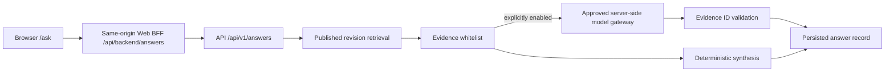

# Evidence-grounded public answering

Atlas treats natural-language answering as a read-only projection over
published encyclopedia revisions. It is not a second publication path and it
does not let a model become a source of record.

## Request boundary

The browser never receives a provider URL, gateway credential, or bearer token
for the API. It posts only to the Web application's same origin. The BFF adds
the authenticated server session and forwards to the Atlas API.

`HARDATLAS_PUBLIC_ANSWER_MODEL_ENABLED` defaults to `false`. Enabling it does
not add a provider default: a call is possible only when
`HARDATLAS_MODEL_GATEWAY_URL` and the approved model alias are configured.
`ModelGatewayConfig` still rejects direct OpenAI and Azure OpenAI provider
hosts unless the separate emergency override is explicitly enabled.

## Retrieval and grounding

1. Resolve explicit entity names, localized names and aliases against current
   published rows.
2. If no entity is named, use bounded lexical term retrieval through the
   configured Search backend.
3. Read the current immutable revisions from PostgreSQL.
4. Build evidence units only from sections and claims with citation IDs that
   resolve inside the same entity revision.
5. Rank evidence using question terms and live Attribute Schema labels. When at
   least one unit has an explicit match, unrelated units are excluded.
6. Return a deterministic cited synthesis, or optionally send only this frozen
   evidence whitelist to the server-side model gateway.

The strict model response contains an answer and selected evidence IDs. Any
unknown or duplicate evidence ID rejects the model output. Transport failure,
invalid structured output, or whitelist violation is visible as
`retrieval-fallback`; the API returns the deterministic cited synthesis and
records stable failure provenance instead of claiming a model success.

Questions without a cited published match return
`insufficient-evidence`. The model is not called in that state.

## Reproducibility

`POST /api/v1/answers` stores the returned `KnowledgeAnswer` in
`knowledge_answer`, including:

- entity and revision IDs;
- selected evidence and citation documents;
- all data versions involved;
- synthesis mode;
- gateway/model/request provenance and token counts when a model was attempted;
- the exact answer shown to the reader.

`GET /api/v1/answers/{id}` replays the stored document instead of regenerating
it from newer revisions. Migration `0004_knowledge_answers` owns this table.

The public UI exposes the answer mode, fixed revision IDs, source tiers,
locators and the opaque answer record ID. It deliberately does not expose the
gateway base URL, API key, Authorization header, prompt internals, or raw
provider response.
