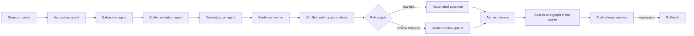

# GAG: generative agent graph architecture

This document uses **GAG** as a working name for an agent-maintained generative
knowledge graph. The name can change without changing the architecture.

## Stable kernel

The kernel owns:

- spaces and taxonomies;
- entity types and versioned schemas;
- entities, aliases, identifiers, and locale variants;
- typed attributes and unit normalization;
- relation definitions and relation edges;
- sections, citations, media, and revisions;
- policies, proposals, reviews, releases, and audit events.

Domain packs are data and declarative schemas. They cannot execute arbitrary
code in the kernel.

## Agent maintenance pipeline

`agent-packs/core` currently provides the executable four-node reference path:
source monitor → structured extraction → entity resolution → evidence
verification. The longer graph below is the target composition as additional
independently versioned Agent packs are enabled.

Agents communicate through typed proposals, never by directly modifying
published rows. Every proposal includes:

- agent, model, prompt, tool, and policy versions;
- source snapshots and extraction spans;
- entity-resolution candidates and confidence;
- field-level additions, changes, removals, and conflicts;
- estimated reach, affected relations, and rollback target.

Proposal creation also emits a transactional
`governance.proposal.created` event. The governance worker evaluates policy
idempotently: safe, evidence-backed, non-destructive changes without active
path conflicts can become accepted automatically, while conflicts and
review-required risk classes enter the human queue. Automatic acceptance still
does not bypass atomic Release publication or rollback safeguards.

The executable registry and scheduling contract is specified in
[`agent-registry-and-scheduling.md`](agent-registry-and-scheduling.md).
The deterministic snapshot-to-candidate boundary is specified in
[`source-extraction.md`](source-extraction.md).

## Dynamic generation

Dynamic generation has three separate layers:

1. **Schema generation:** propose a new entity type, attribute, relationship, or
   page block when content cannot be represented by existing schemas.
2. **Content generation:** draft structured claims and prose from evidence.
3. **View generation:** assemble page blocks from a versioned view definition;
   the frontend renders an allow-listed component vocabulary.

No generated executable code is published. Schema and view definitions are
validated JSON documents with compatibility checks and migrations.

## Storage topology

- PostgreSQL: source of truth for schemas, entities, claims, relations,
  proposals, revisions, policies, and releases.
- OpenSearch: multilingual lexical search, aliases, filters, and optional
  hybrid retrieval.
- S3/MinIO: immutable source snapshots and media derivatives.
- Redis/Dramatiq: scheduling and retry coordination, never the source of truth.
- PostgreSQL outbox: atomic propagation into search, graph projections, and
  downstream notifications.

P0 stores relation edges in PostgreSQL. A dedicated graph database is an
optional projection only after measured traversal needs justify it.
