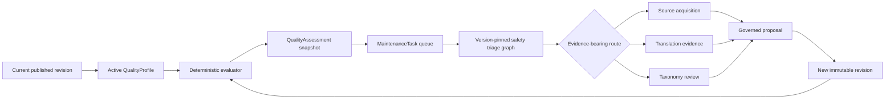

# Knowledge quality maintenance

Atlas turns quality gaps into versioned, explainable work instead of relying
on one global completeness percentage. Each entity type may activate exactly
one declarative `QualityProfile` through its Domain Pack.

## Versioned quality profile

A profile pins:

- the target `entityTypeId` and immutable `schemaVersion`;
- required content locales and attribute IDs;
- minimum citation and section counts;
- an optional evidence-freshness interval;
- healthy and critical score thresholds.

The registry rejects profiles that target an unknown entity type, require an
attribute outside that type, or create two active profiles for one type. A
profile is data, not executable policy: it cannot import modules, invoke tools,
or run arbitrary expressions.

Static Pack manifests reference `qualityProfileFiles`. The runtime Domain Pack
constructor emits `qualityProfiles` in the same draft as spaces, taxonomy,
attributes, relationships and views. Publication and rollback update the
`quality-profile` Schema Activation in the same database transaction as the
rest of the Pack.

## Assessment and task lifecycle

The evaluator checks required attributes, localization, citation and section
minimums, uncited claims or sections, taxonomy placement and staleness. Every
issue includes a stable ID, severity, JSON-like path, human message, penalty
and bounded repair action such as `add-citation`, `translate` or
`refresh-evidence`.

Assessment IDs are derived from entity ID, revision ID, profile ID and profile
version. Task IDs are derived from the assessment and issue path. Repeating a
scan therefore updates timestamps without creating duplicate work or duplicate
Outbox requests.

When a new entity revision or quality-profile version replaces the source of
an open task, that task becomes `superseded`. If a repeated assessment of the
same revision no longer contains an issue, the task becomes `resolved`.
Historical rows remain available for audit and rule-version replay.

Migration `0005_quality_maintenance` owns `quality_assessment` and
`maintenance_task`; `0006_maintenance_work_queue` owns the routed Work Item
queue.

## Safe Agent dispatch

Creating a task atomically emits `quality.maintenance.requested`. The Outbox
dispatcher resolves the immutable `quality-maintenance-triage@graph-1.0.0`
definition and atomically changes the task from `open` to `scheduled`, pins its
schedule ID, creates `GraphRunSchedule`, and emits `agent.graph.scheduled`.
Retrying the first event resolves to the same deterministic schedule ID and
idempotency key.

The schedule input contains only the persisted task, assessment, entity,
revision, quality profile, issue and action identities. If the entity has
already moved to another current revision, the transaction marks the task
`superseded` and creates no graph work. A task cannot be rebound to another
schedule.

The triage Agent is deliberately deterministic: its budget permits zero model
calls and its proposal allowlist is empty. It maps the bounded repair action to
`source-acquisition`, `translation-evidence`, or `taxonomy-review`, always
returns `requiresEvidence=true` and `proposalEligible=false`, and completes
without a content proposal. Later route-specific work must acquire evidence
and pass the normal governance and release pipeline before it can produce a
new immutable revision.

The completed triage Run is not the end of the workflow. It atomically creates
a leaseable, revision-pinned Work Item whose route and capability requirements
can be consumed by a large Agent pool. Claim collision, expiry, heartbeat,
release and token-redaction semantics are specified in
[`maintenance-work-queue.md`](maintenance-work-queue.md).

## Runtime boundaries

- `POST /api/v1/quality/scans` requires `agent.run`; a missing or invalid
  entity is isolated in the result instead of aborting unrelated assessments.
- Summary, assessment and task reads require `maintenance.read`.
- The Worker exposes retryable quality scan and maintenance dispatch actors;
  the scheduler repeats the deterministic scan at
  `HARDATLAS_QUALITY_SCAN_SECONDS`.
- The Admin `/quality` workbench calls only its same-origin
  `/api/backend/api/v1` BFF. It shows exact entity revision, profile version,
  issue path, penalty, dispatch state and pinned Agent graph schedule.
- Quality evaluation never calls a model. Later Agent execution may use only
  the configured server-side model gateway and must still create governed
  proposals rather than writing published knowledge directly.

This layer is intentionally generic: an animal Pack can require scientific
classification and evidence freshness while an electronic-component Pack can
require electrical specifications, without adding product-specific branches
to API or UI code.
