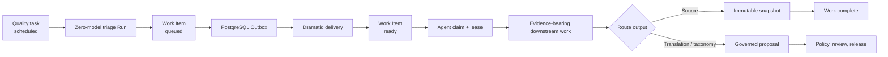

# Maintenance Work Queue

## Purpose

Atlas separates detecting a knowledge gap, deciding its safe route, and doing
the evidence-bearing work. A completed quality triage graph therefore does not
directly call a source, write a translation, change taxonomy, or create a
proposal. It atomically creates a version-pinned `MaintenanceWorkItem`.

This boundary lets a large and changing pool of Agents consume work without
giving queue consumers permission to mutate published encyclopedia content.

## Durable route lifecycle

`GraphRunSchedule.completed`, the Work Item and
`maintenance.work.requested` are committed in one transaction. Work identity
is derived from the quality task, current revision, route, triage schedule and
triage Run. Event replay therefore returns the same record and cannot create a
second unit of work for one task.

The three initial routes are:

- `source-acquisition`: source registry lookup, acquisition request and
  evidence creation. The deterministic router ranks only active,
  policy-allowed sources whose entity-type, taxonomy and locale scopes match
  the pinned entity. Explicit scopes outrank universal sources, then trust
  tier breaks rank. A tied best rank or no eligible source blocks the Work
  Item for intervention instead of guessing;
- `translation-evidence`: entity read, evidence-backed translation proposal
  and evidence creation. The submitting Agent must hold the Work Item lease,
  target the locale recorded by the quality issue, provide every currently
  missing localized field and cite evidence already present on the pinned
  revision;
- `taxonomy-review`: taxonomy read, taxonomy proposal and evidence creation.
  The target node must exist and be allowed by the active entity-type Schema,
  and the proposal must cite the pinned revision.

All Work Items carry `requiresEvidence=true` and
`proposalEligible=false`. The latter means the routing record itself can never
be treated as a content proposal.

## Multi-Agent leases

The API exposes read, claim, heartbeat, release, block and complete operations under
`/api/v1/maintenance/work-items`.

- Reads require `maintenance.read`.
- Claim, heartbeat and release require `agent.run`.
- A claim leases one ready item to the authenticated principal for 30–3600
  seconds.
- A repeated claim by the same principal returns the existing lease.
- Another principal receives a conflict until the lease expires.
- An expired lease may be claimed again and increments the attempt counter.
- Heartbeats require both the authenticated assignee and the exact lease
  token. Releasing clears all lease state and returns the item to `ready`.
- Blocking requires a human-readable reason and clears the lease while keeping
  the item visible for intervention.
- An authorized operator may requeue only a blocked item. Requeue revalidates
  the pinned entity revision, clears the old reason, returns the item to
  `queued` and commits a new `maintenance.work.requested` Outbox event. A stale
  revision is superseded instead of being retried.
- Completion clears the lease and requires typed evidence links that the
  repository resolves before committing. A source-acquisition item requires a
  persisted source snapshot. Translation work additionally requires a
  translation/content governed proposal; taxonomy work requires a
  relation/schema governed proposal. Unknown snapshots, citations, jobs,
  proposals, cross-entity proposals or route-incompatible outputs fail closed.

Lease tokens are returned only by the claim response. List, detail, heartbeat
release, block and completion responses deliberately omit them, and audit
metadata never stores them.

Every activation rechecks the entity's current revision. Claim repeats the
same check under the row lock. If the revision changed, both the Work Item and
its source quality task become `superseded`; no Agent receives obsolete work.
PostgreSQL `FOR UPDATE` protects competing claimers, while SQLite uses the same
transactional code path for deterministic local tests.

## Runtime boundary

The queue is server-side state. Admin reads it only through the same-origin
`/api/backend` BFF. Activation and lease operations do not call a model.
Future route-specific Agents may use a model only through the configured
server-side model gateway and still must produce evidence-backed governed
proposals before publication.

Translation and taxonomy routes are available as typed Agent submission
boundaries:

- `POST .../{workItemId}/translation-proposal`
- `POST .../{workItemId}/taxonomy-proposal`

Both endpoints require `agent.run` and `proposal.create`, validate the lease,
entity revision, citations and route-specific paths, and atomically create the
governed proposal plus complete the Work Item. Proposal IDs are deterministic,
so a lost-response replay returns the same output. Translation proposals may
only append the missing `/names` or `/description` locale; taxonomy proposals
may only replace `/taxonomyNodeIds`. Both are fixed to `medium` risk and enter
human review through the existing governance Outbox. They cannot directly
publish a revision.

The source-acquisition route is implemented without a model. Activation
claims the Work Item under `agent-source-acquisition-router@1.0.0`, creates one
idempotent `SourceAcquisitionJob` pinned to the Work Item, revision, source and
source version, then releases the lease while network work proceeds. On
successful acquisition, the Worker reacquires the item, verifies the persisted
snapshot and linked job, and completes it with typed evidence/output links. A
retry against an already completed job only reconciles the same records.
Source acquisition proves that evidence was collected; it does not edit
published encyclopedia content.

Admin `/quality` exposes the blocked reason and a guarded “重新入队” action.
The browser still calls only the same-origin BFF; the API records the actor,
fixed revision and new Outbox event in the tamper-evident audit chain.

Migration `0006_maintenance_work_queue` owns the
`maintenance_work_item` table.
