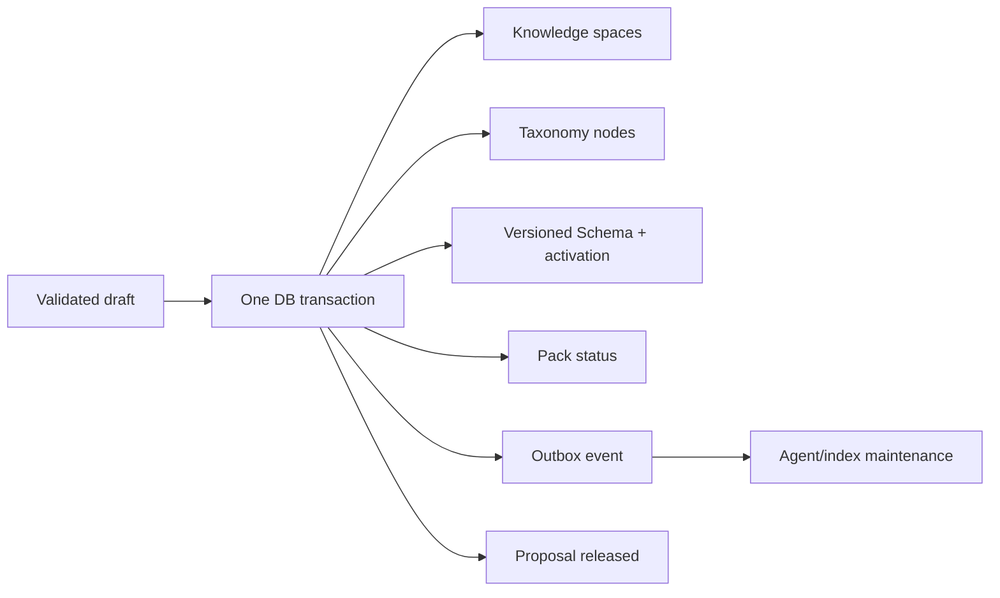

# Runtime Domain Packs

## 目标

Atlas 的领域扩展不依赖前端条件分支。运行时 Domain Pack 将知识空间、分类节点、实体
类型、属性、关系类型、页面视图与质量档案作为一个有版本的发布单元，使“天文学”
“地质学”或“器物学”等新领域可以在不修改应用代码的情况下进入公开百科。

管理入口是 `/schema/domain-packs`，接口基路径是
`/api/v1/domain-packs`。

文件型 Pack 使用同一契约。`domain-packs/core` 声明基础知识空间和根分类，动物、植物
与电子元件 Pack 声明各自的类型、属性、关系、视图和质量档案。启动合并注册表时会验证跨 Pack
引用；生产环境必须设置 `HARDATLAS_SEED_FIXTURE_CONTENT=false`，并会拒绝把雪豹、
银杏和 NE555 等演示实体注入线上数据库。

## 生命周期

1. 构造器生成包含稳定 ID、不可变版本和 `kernelVersion` 的声明。
2. `POST /domain-packs/validate` 对完整候选做只读影响分析。
3. `POST /domain-packs` 原子保存不可变版本草稿及一个高风险 Schema 提案。
4. 策略评估将提案送入双人审核；两个不同审核主体批准后状态才会成为 `accepted`。
5. `POST /domain-packs/{id}/{version}/publish` 在单个数据库事务中写入空间、分类、
   Schema Activation（包括质量档案）、Domain Pack 状态和 PostgreSQL Outbox；同时捕获精确的发布前
   Activation、空间与分类快照。
6. 同一 Pack 的旧发布版本被归档；已发布版本内容不可修改，提案同时进入
   `released`。
7. `GET /domain-packs/{id}/{version}/diff` 生成与指定版本或前一版本的确定性清单差异；
   `GET .../rollback-analysis` 在执行前列出内容、Schema、分类与空间依赖。
8. 只有分析结果为 `safe`，且调用者提交的 `expectedPublishedAt` 仍与当前发布一致时，
   `POST .../rollback` 才会在单事务中恢复发布前快照、可选恢复前一归档版本，并写入
   Outbox 和不可变审计记录。

发布成功后，公开 Web 的空间、分类和搜索类型筛选通过现有动态接口自动出现新领域。
创建条目时，Admin Schema 工作室也会从同一 Schema Registry 自动生成表单。

## 发布守卫

验证器拒绝：

- Pack 内重复 ID；
- 不存在或跨空间的分类父节点；
- 分类环；
- 未解析的空间、属性、关系、实体类型或默认视图引用；
- 质量档案引用未知实体类型、类型外属性，或同一类型存在多个活动档案；
- 用扩展包直接改写已有分类；
- 用扩展包直接改写已有 Schema。

已有 Schema 的演进必须走独立的 Schema Migration 流程，以保留影响分析、实体回放
和回滚能力。Domain Pack 只负责安全新增，以及为已有知识空间增加根分类；其自身同样
必须提供治理依据 ID，并通过高风险 Schema 提案的双人审核。

## 事务边界

如果任一文档违反唯一性或不可变约束，整个事务回滚，不会出现“分类已出现但实体类型
尚未激活”的半发布状态。

## 回滚安全模型

回滚不会从当前注册表推测历史状态。旧版本如果没有在发布时记录
`rollbackSnapshot`，系统会明确拒绝回滚。分析器会阻断下列情况：

- 待移除类型、属性、关系或分类仍被公开实体使用；
- 其它活动实体类型仍引用待移除属性、关系或视图；
- 其它活动关系类型仍引用待移除实体类型；
- 其它分类或知识空间仍依赖待移除节点或空间；
- 发布后 Schema Activation 已被其它流程改变；
- 快照缺失，或目标已不再是当前发布版本。

管理端版本注册表同时显示 added/modified/removed 清单、依赖资源 ID 和具体 dependent
ID。安全分析不是建议性提示：仓储层在事务内再次检查当前 Activation、空间和分类
内容，避免分析与执行之间的竞态。
