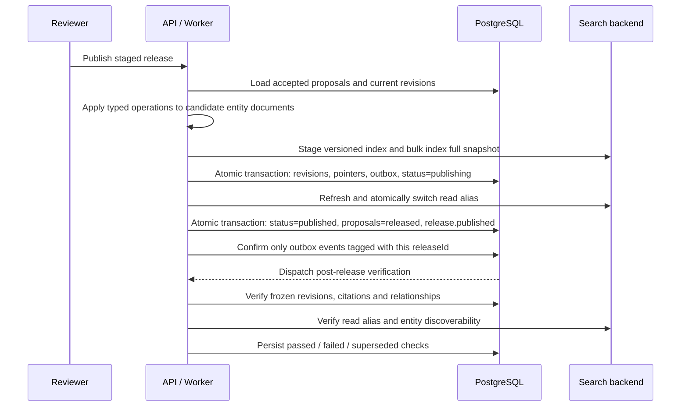

# Search indexing and atomic knowledge publication

## Search boundary

The API depends on the `SearchBackend` protocol rather than OpenSearch
directly. Two implementations share the same observable contract:

- `LexicalSearchBackend` is deterministic and process-local for tests and
  offline development.
- `OpenSearchBackend` provides multilingual field weighting, type filters,
  publication-status filters, highlighting, versioned indexes, and a stable
  read alias.

Search documents contain only published discovery fields: entity ID, slug,
space, type, canonical name, localized names, aliases, descriptions, taxonomy
IDs, locales, source tiers, citation count, publication status, and data
version. PostgreSQL remains the source of truth for the returned entity
document.

`GET /api/v1/search` is both a query and browse endpoint. An empty query returns
the published catalogue; non-empty queries use weighted lexical matching.
Space, entity type, taxonomy node, content locale, source tier and minimum
source count are native backend filters. `limit` and `offset` are applied in
the backend, and every page returns the total plus live facet counts for the
same filtered result set. The in-memory implementation and OpenSearch expose
the same contract; the latter uses terms aggregations and never asks the Web
server to download the whole catalogue for filtering.

## Release sequence

Proposal paths are declarative. The publisher supports claim addressing,
localized section-body replacement, and validated JSON Pointer operations.
It rejects stale `before` values, unknown citations, missing paths, cross-entity
proposals, and non-accepted proposal states.

Each release manifest records:

- previous and resulting entity revision IDs;
- active search index and alias;
- rollback search index;
- data, Schema, and policy versions;
- manual or automatic trigger plus the initiating principal;
- proposal IDs and lifecycle timestamps.
- post-release verification attempts, check evidence, and automatic rollback
  reason.

If alias activation fails, the database retains `publishing`, the new index,
and release-scoped outbox events. Repeating the same publish request only
reactivates that staged index and completes the manifest; it does not apply the
proposal twice. Unrelated pending entity events are never acknowledged.

Rollback is the symmetric Saga. It stages a restored index, atomically restores
recorded revisions and archives entities created by the release under
`rolling-back`, then switches the alias and completes `rolled-back`. Alias
failure is retryable with rollback events still pending. Both directions reject
the operation if an affected entity revision changed after its frozen release
snapshot.

## Post-release verification

Publication completion writes `release.published` in the same PostgreSQL
transaction as `status=published` and the final proposal transitions. The
Outbox dispatcher sends that release ID to a retryable verification Worker.
The Worker records, rather than infers, seven checks:

- the manifest is published and its revision snapshot is complete;
- every frozen entity revision exists and remains publishable;
- every claim, section, and relationship citation resolves inside that
  revision;
- relationship sources and targets resolve to known entities;
- the search backend is ready;
- the read alias points at the release index;
- every changed entity is discoverable by its canonical name.

A search outage or transport error leaves verification `running` and raises a
retryable infrastructure failure. A deterministic revision, citation,
relationship, alias, or discoverability regression records `failed`.
Automatic releases then mark the reason and invoke the shared rollback Saga
when `HARDATLAS_AUTO_ROLLBACK_ENABLED=true`; manual releases surface the same
checks but preserve the human rollback decision. A delayed event whose alias
already belongs to a newer published release becomes `superseded` and never
rolls that newer release back.

Admin `/releases` renders every check and exposes a permission-protected
`POST /api/v1/releases/{release_id}/verify` retry. Browser requests continue
to use the Admin same-origin BFF.

## Production execution

API and Worker both invoke the same `ReleaseOrchestrator`; entity operation
application, revision freezing, full-index staging, alias activation,
completion and retry semantics are not duplicated in route or actor code.

When a proposal first reaches `accepted`, its state transaction also writes
`governance.proposal.accepted`. The publication dispatcher enqueues the
triggering proposal, then the publication Worker collects up to
`HARDATLAS_AUTO_RELEASE_BATCH_SIZE` currently accepted, entity-bound proposals
under the same policy version. The sorted proposal IDs and state versions form
a deterministic Release ID and data version. Duplicate events therefore join
or resume the same manifest instead of publishing the operations twice.

Automatic publication requires
`HARDATLAS_SEARCH_BACKEND=opensearch`; a process-local lexical index cannot
serve as a cross-process production alias. Set
`HARDATLAS_AUTO_RELEASE_ENABLED=false` to retain automatic policy evaluation
while requiring a human to create Release batches. Schema and global proposals
are never placed in this entity-release path.
